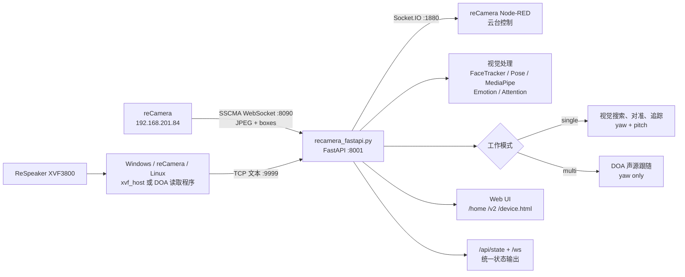

# reCamera Multimodal：架构、运行流程与 Debug 手册

> 唯一流程主文档
> 版本：3.0
> 更新日期：2026-06-19
> 当前 reCamera 无线 IP：`192.168.201.84`

本文档描述当前代码真实实现，不描述尚未完成的产品设想。部署、启动、单人追踪、多人 DOA、页面、API、实现细节、测试和排障统一以本文为准。

---

## 1. 系统目标与当前能力

本项目把 reCamera 云台摄像头、视觉模型、ReSpeaker DOA 和 Web 控制台整合为两个互斥工作模式：

| 模式 | 输入 | 核心处理 | 云台行为 | 当前输出 |
|---|---|---|---|---|
| 单人模式 | reCamera 视频 | 人体/人脸检测、目标锁定、情绪与专注分析 | yaw + pitch 视觉追踪 | 视频、框选、追踪状态、情绪、专注度 |
| 多人模式 | TCP DOA | 声源角度、speech 状态、新鲜度判断 | 仅 yaw 声源跟随 | DOA、声源方向、目标 yaw、链路状态 |

当前多人模式默认是 `doa_only`：

- ReSpeaker 不挂载到 WSL。
- DOA 由连接 ReSpeaker 的 Windows、reCamera 或其他主机读取。
- DOA 通过 TCP `9999` 转发给 FastAPI。
- 默认不启动 WSL 本地录音。
- `save_audio=true` 仍保留为可选实验入口，但不属于当前标准流程。
- ASR、说话人分离和会议摘要尚未成为生产链路。

## 2. 总体架构



### 2.1 网络端口

| 地址/端口 | 服务 | 用途 |
|---|---|---|
| `192.168.42.1:22` | reCamera USB 网络 SSH | 初始化及查询无线 IP |
| `192.168.201.84:22` | reCamera Wi-Fi SSH | 无线维护 |
| `192.168.201.84:80` | 官方 Demo | reCamera 官方页面 |
| `192.168.201.84:1880` | Node-RED Dashboard | 云台 Socket.IO 控制 |
| `192.168.201.84:8090` | SSCMA WebSocket | 视频和设备检测框 |
| `0.0.0.0:9999` | Network DOA Receiver | 接收远程 DOA |
| `0.0.0.0:8001` | FastAPI | 项目页面、API、MJPEG、WebSocket |

旧的 `设备IP:8080/api/...` 链路不可用。所有项目页面必须调用 FastAPI 同源 `/api/...`。

## 3. 目录与模块职责

### 3.1 主入口

| 文件 | 职责 |
|---|---|
| `recamera_fastapi.py` | 当前推荐入口；统一管理视频、模式、云台、DOA、模型、API 和页面 |
| `main_phase3.py` | 旧 Phase 3 控制实验入口；适合 Mock 和状态机测试 |
| `recamera_demo.py` | 轻量设备/DOA 演示入口；不是当前主流程 |

日常开发和演示使用 `recamera_fastapi.py`。

### 3.2 硬件与数据输入

| 文件 | 职责 |
|---|---|
| `vision/video_stream.py` | 连接 `ws://<device>:8090/`，接收 JPEG 与检测框 |
| `hardware/recamera_client.py` | Phase 3/旧 Demo 使用的通用设备客户端 |
| `audio/network_doa.py` | 当前默认 DOA 接收器；监听 TCP 文本并提供统一读取接口 |
| `audio/doa.py` | DOA 文本解析及可插拔 source 基础实现 |
| `audio/respeaker_doa.py` | 旧 USB HID DOA 实现，仅作为可选回退 |
| `tools/send_doa_tcp.py` | 从 mock、stdin 或 `xvf_host` 命令向 TCP 接收器转发 DOA |

### 3.3 视觉处理

| 文件 | 职责 |
|---|---|
| `vision/face_tracker_v2.py` | InsightFace/SCRFD 检脸、Kalman/ByteTrack、ArcFace 信息 |
| `vision/pose_estimator.py` | YOLO11 pose，提供人体框和关键点 fallback |
| `vision/mediapipe_face.py` | Face Landmarker 精细面部点 |
| `vision/emotieff_adapter.py` | EmotiEffLib 情绪推理 |
| `vision/attention_engine.py` | 专注度及基线计算 |
| `vision/eye_metrics.py` | EAR、眨眼、PERCLOS 等眼部指标 |
| `vision/llm_reflect.py` | 本地轻量反思/日记回复 fallback |

### 3.4 控制与状态

| 文件 | 职责 |
|---|---|
| `core/gimbal_mode_state.py` | AI、手动、睡眠、待机、急停模式优先级 |
| `core/state_machine.py` | Phase 3 实验状态机 |
| `core/control_filter.py` | 控制平滑、死区、步长限制 |
| `core/safety_layer.py` | 真实控制安全门 |
| `core/fusion_controller.py` | Phase 3 多源融合实验 |

FastAPI 主流程的实时控制主要位于 `recamera_fastapi.py` 中的 `state_push_loop()`、`GimbalController`、人脸捕获状态和 DOA 跟随函数。

### 3.5 页面

| 页面 | 路由 | 用途 |
|---|---|---|
| `dashboard/home.html` | `/home` | 心屿用户侧产品主界面：情绪、专注、多人场景、日记、LLM 对话、健康建议 |
| `dashboard/recamera_v2_live.html` | `/v2` | 开发/调试控制台：实时视频、单人追踪、多人 DOA、云台、安全控制、日志 |
| `dashboard/recamera_device.html` | `/device.html` | Legacy 设备调试页：底层云台与设备状态控制，不作为主产品入口 |
| `dashboard/debug.html` | `/debug.html` | 通用 Debug 页 |
| `dashboard/camtest.html` | `/camtest.html` | 摄像头测试 |

所有页面使用相对路径调用 FastAPI，便于 localhost、局域网和平板访问。

### 3.6 Web 页面打开方式

前提：FastAPI 服务已经启动，并监听 `0.0.0.0:8001`。

本机预览：

```text
http://localhost:8001/home
http://localhost:8001/v2
http://localhost:8001/device.html
```

Windows 浏览器访问 WSL 服务时，也可以使用：

```text
http://127.0.0.1:8001/home
http://127.0.0.1:8001/v2
http://127.0.0.1:8001/device.html
```

iPad、手机或同一局域网内其他设备访问时，不要使用 `localhost`，需要替换成运行 FastAPI 的电脑局域网 IP：

```text
http://<PC局域网IP>:8001/home
http://<PC局域网IP>:8001/v2
http://<PC局域网IP>:8001/device.html
```

页面选择：

- `/home`：真实产品主界面。用户侧功能都从这里进入或直接操作，包括情绪监测、专注度监测、多人场景跟踪、情绪日记、LLM 对话和健康建议。
- `/v2`：开发/调试控制台。用于观察实时视频、检测框、情绪/专注数据、DOA、云台状态、WebSocket/HTTP 状态和事件日志。
- `/device.html`：legacy 设备调试页。仅在需要旧版底层云台控制或设备状态排查时使用。
- `/debug.html`：通用调试页。
- `/camtest.html`：摄像头测试页。

官方 reCamera demo 与本项目页面不是同一个入口。官方 demo 打开方式见下一节“reCamera 初始化与官方 Demo”。

## 4. reCamera 初始化与官方 Demo

1. 接上 USB 线，在 Ubuntu 中登录：

   ```bash
   ssh recamera@192.168.42.1
   ```

2. 如需密码：

   ```text
   IntelligentHardware0526_
   ```

3. 查询无线地址：

   ```bash
   ip addr
   ```

4. 找到 `wlan0` 的 IP。电脑与 reCamera 必须处于同一网络。

5. 拔掉 USB，在浏览器访问该 IP：

   ```text
   http://192.168.201.84/
   ```

无线 IP 可能被 DHCP 重新分配。网络环境变化后必须重新查询，并同步更新代码默认值和本文档。

## 5. 安装与配置

### 5.1 Python 依赖

```bash
cd ~/recamera_multimodal
python3 -m pip install -r requirements.txt --break-system-packages
```

主要依赖包括 FastAPI、Uvicorn、OpenCV、ONNX Runtime、MediaPipe、Socket.IO、WebSocket 和 NumPy。

`insightface` 为推荐可选依赖：

```bash
python3 -m pip install insightface --break-system-packages
```

`pyusb` 和 `sounddevice` 是旧 USB/可选录音能力所需；TCP DOA-only 标准流程不依赖 WSL 访问 ReSpeaker USB。

### 5.2 环境变量

#### DOA

```bash
export RECAMERA_DOA_SOURCE=tcp
export RECAMERA_DOA_HOST=0.0.0.0
export RECAMERA_DOA_PORT=9999
export RECAMERA_DOA_SPEECH_HOLD=0.8
```

上述均为默认值。临时回退旧 USB HID：

```bash
export RECAMERA_DOA_SOURCE=usb
```

#### 可选本地录音

```bash
export RECAMERA_AUDIO_DEVICE=<sounddevice输入设备编号>
```

标准 DOA-only 流程不设置它。

#### LLM/DeepSeek

```bash
export DEEPSEEK_API_KEY=<key>
export DEEPSEEK_API_URL=https://api.deepseek.com/chat/completions
export DEEPSEEK_MODEL=deepseek-v4-flash
export DEEPSEEK_MAX_TOKENS=600
```

未配置 API Key 时，日记聊天会使用本地轻量 fallback。

## 6. 标准启动流程

### 6.1 启动前检查

```bash
ping -c 3 192.168.201.84
nc -zv 192.168.201.84 80
nc -zv 192.168.201.84 1880
nc -zv 192.168.201.84 8090
```

### 6.2 安全模式

```bash
cd ~/recamera_multimodal
python3 recamera_fastapi.py
```

安全模式会：

- 连接真实视频；
- 加载视觉模型；
- 监听 TCP DOA；
- 执行完整状态逻辑；
- 更新云台目标状态；
- 不向真实云台发送运动指令。

关键日志：

```text
Device IP: 192.168.201.84
SSCMA connected
Network DOA listening on 0.0.0.0:9999
DOA ready for yaw-only sound tracking (source=tcp)
GIMBAL DRY-RUN
```

服务启动后可打开页面。完整页面定位与局域网访问方式见“3.6 Web 页面打开方式”。

```text
http://localhost:8001/home
http://localhost:8001/v2
http://localhost:8001/device.html
```

### 6.3 自动验收

保持服务运行，另开终端：

```bash
cd ~/recamera_multimodal
python3 tools/debug_home_pipelines.py
```

诊断依次验证：

1. 单人模式 API 成功；
2. 单人模式启用视觉追踪；
3. 多人模式关闭人脸追踪；
4. 自动连接 TCP `9999`；
5. 注入 `35°`、`speech=true`；
6. `packet_count` 增长；
7. DOA 角度进入 `/api/state`；
8. `sound_follow` 产生目标 yaw；
9. 多人模式不访问本地录音设备。

通过标志：

```text
Result: all checks passed
```

### 6.4 真实云台控制

只有安全模式验收通过后执行：

```bash
python3 recamera_fastapi.py --device-ip 192.168.201.84 --no-dry-run
```

确认日志包含：

```text
Gimbal connected via Socket.IO
```

真实控制首次测试应使用小角度，并保持设备周围无障碍物。

### 6.5 停止

正常停止：

```text
Ctrl+C
```

API 急停：

```bash
curl -X POST http://localhost:8001/api/gimbal/stop
```

## 7. 单人模式完整流程

### 7.1 模式切换

入口：

```http
POST /api/single_track/start
POST /api/single_track/stop
GET  /api/single_track/state
```

启动单人模式时：

```text
tracking_mode = single
_sound_tracking = false
_conversation_recording_requested = false
face_tracking = true
gimbal sound_tracking = false
```

单人和多人模式互斥。

### 7.2 视频输入

`SSCMAVideoClient` 连接：

```text
ws://192.168.201.84:8090/
```

后台线程持续保存：

- 最新 JPEG；
- SSCMA 检测框；
- 分辨率；
- FPS；
- 连接状态。

FastAPI 将 JPEG 转为：

```text
/video_feed
```

前端通过 `/ws` 和 `/api/state` 获得状态与叠加信息。

### 7.3 搜索、对准与追踪状态

启动搜索阶段由 `_startup_phase` 表示：

| Phase | 含义 | 行为 |
|---|---|---|
| `-1` | 初始检查/归中 | 若已有脸直接追踪；若有人进入 Phase 2；否则回 `yaw=180, pitch=90` |
| `0` | 归中完成 | 再检查脸/人；没有目标则准备扫描 |
| `1` | 扫描找人 | yaw 围绕 `180°` 在约 `140°..220°` 扫描，pitch 保持 |
| `2` | 人体已发现 | 根据人体框预测脸部区域，同时调整 yaw/pitch |
| `3` | 完整人脸追踪 | 持续使用人脸目标控制云台 |

关键参数：

```text
SWEEP_CENTER_YAW = 180
SWEEP_AMPLITUDE_DEG = 40
SWEEP_STEP_DEG = 2
person minimum confidence ≈ 0.42
face minimum confidence ≈ 0.45
```

### 7.4 检测优先级

目标输入优先级：

1. `FaceTrackerV2` 完整人脸；
2. YOLO pose 人体；
3. YuNet/关键点 fallback；
4. 无目标时扫描。

`FaceTrackerV2` 提供 SCRFD 检测、track ID、bbox、face center 和五点信息。YOLO pose 用于人脸暂不可用时的人体对准。MediaPipe 提供更密集的面部点，服务于精细指标和 fallback。

### 7.5 人脸捕获状态

除启动 Phase 外，还有细粒度人脸捕获状态：

| 状态 | 含义 |
|---|---|
| `SEARCHING` | 尚未稳定确认目标 |
| `CANDIDATE` | 发现候选，等待连续确认 |
| `LOCKED` | 已锁定稳定目标 |
| `LOST_GRACE` | 短暂丢脸，按速度预测进行局部重捕获 |

短暂丢失时不会立即全局扫描，而会在最后目标附近进行预测性小范围搜索。超过宽限时间后回到 `SEARCHING`。

### 7.6 控制原则

- yaw 控制水平居中；
- pitch 控制垂直脸部位置；
- 使用 EMA、步长限制和死区降低抖动；
- 手动、睡眠、待机、急停模式优先于 AI；
- 非 AI 模式结束后，自动流程会重新从安全阶段恢复。

### 7.7 情绪与专注

完整脸部可用时：

```text
face crop
  -> EmotiEffAdapter
  -> emotion + confidence + probabilities
```

专注链路：

```text
face landmarks / eye metrics
  -> AttentionEngine
  -> attention state + score
```

相关状态位于：

```text
emotieff
attention
mp_face
eye_metrics
```

情绪和专注不是云台控制的安全前置条件；模型不可用时不应阻塞视频和基础追踪。

## 8. 多人 TCP DOA 模式完整流程

### 8.1 为什么不挂载到 WSL

当前架构把 ReSpeaker 的硬件读取留在真正连接设备的主机，WSL 只接收标准文本：

```text
ReSpeaker
  -> xvf_host / 设备侧读取
  -> TCP 文本
  -> NetworkDOA
  -> FastAPI 多人模式
```

这样避免 USBIP、HID 权限、PortAudio 设备映射和 WSL 重连问题。

### 8.2 TCP 接收器

`audio/network_doa.py` 默认监听：

```text
0.0.0.0:9999
```

支持输入：

```text
35
35 deg
0.6109 rad
AUDIO_MGR_SELECTED_AZIMUTHS 0.6109 (35.0 deg)
{"azimuth_deg":35,"speech":true}
{"doa":0.6109,"unit":"rad","has_speech":true}
```

接收器维护：

| 字段 | 含义 |
|---|---|
| `doa_deg` | 最新角度 |
| `has_speech` | 当前是否处于 speech hold 窗口 |
| `age` | 距离最新有效包的秒数 |
| `sender_connected` | TCP 发送端是否在线 |
| `packet_count` | 累计有效角度包数 |
| `last_line` | 最近一次原始输入 |

纯角度和 `xvf_host` 文本无法显式携带 VAD，因此每个有效包会将 speech 保持约 `0.8s`。JSON 可以使用 `speech` 或 `has_speech` 明确控制。

### 8.3 发送端

Mock：

```bash
python3 tools/send_doa_tcp.py \
  --host 127.0.0.1 \
  --mock-angle 35
```

真实 `xvf_host`：

```bash
python tools/send_doa_tcp.py \
  --host <WSL_IP> \
  --command "xvf_host.exe AUDIO_MGR_SELECTED_AZIMUTHS"
```

Windows 访问 WSL 时先尝试 `127.0.0.1`；不通时在 Ubuntu 查询：

```bash
hostname -I
```

并使用实际 WSL IP。还需允许 Windows 防火墙访问 TCP `9999`。

### 8.4 模式切换

入口：

```http
POST /api/multi_track/start
POST /api/multi_track/stop
GET  /api/multi_track/state
```

标准启动：

```bash
curl -X POST http://localhost:8001/api/multi_track/start \
  -H 'Content-Type: application/json' \
  -d '{"save_audio":false}'
```

启动后：

```text
tracking_mode = multi
_sound_tracking = true
_conversation_recording_requested = false
face_tracking = false
gimbal sound_tracking = true
```

主循环会跳过单人视觉追踪、情绪和专注流程，只执行 DOA 状态及 yaw 跟随。

### 8.5 yaw 映射

输入约定：

```text
0° = 正前方
正角度 = 右侧
负角度 = 左侧
```

基础映射：

```text
target_yaw = 180 + signed_doa
```

控制限制：

- 目标裁剪到云台安全范围；
- 单次最大变化约 `12°`；
- DOA `age > 1s` 时不移动；
- 没有 speech 时不移动；
- pitch 不参与多人声源跟随。

`sound_follow.reason` 常见值：

| 值 | 含义 |
|---|---|
| `sound_tracking_disabled` | 多人声源模式未启用 |
| `doa_unavailable` | 接收器无法创建 |
| `stale_doa` | 数据过期 |
| `waiting_for_speech` | 有角度但当前无 speech |
| `command_ready` | 已生成目标 |
| `command_sent` | 已发送真实或 dry-run 控制 |
| `already_aligned` | 已接近目标 |

### 8.6 DOA-only 与录音

默认：

```text
conversation.mode = doa_only
conversation.active = false
```

这是正常状态。

只有显式设置：

```json
{"save_audio":true}
```

才会创建 `ConversationRecorder` 并尝试 `sounddevice.InputStream`。如果 WSL 没有音频输入，录音失败不代表 TCP DOA 失败。

当前标准流程不保证：

- 音频文件；
- ASR 转写；
- 说话人声纹分离；
- 会议摘要。

## 9. 前端与状态同步

### 9.1 状态来源

后端约每 `200ms` 构建状态快照：

```text
build_state_snapshot()
  -> WebSocket /ws
  -> GET /api/state
```

`/api/state` 返回 `{"type":"state_snapshot","data":{...}}`，主要业务字段位于 `data`：

```text
gimbal
tracking_mode
video
pose
doa
sound_follow
conversation
face_tracking
face_lock
face_capture
tracking_debug
attention
emotion / emotieff
eye_metrics
```

### 9.2 模式互斥

单人模式：

- 显示视觉、情绪、专注；
- 启用 face tracking；
- 关闭 sound tracking。

多人模式：

- 启用 TCP DOA；
- 关闭 face tracking；
- 仅控制 yaw；
- 页面显示 DOA 和声源目标；
- 默认不显示正在录音状态。

### 9.3 局域网和平板

FastAPI 默认监听 `0.0.0.0`，平板访问：

```text
http://<PC局域网IP>:8001/home
```

不要在平板使用 `localhost`。

Windows 防火墙可放行：

```powershell
New-NetFirewallRule `
  -DisplayName "reCamera FastAPI 8001" `
  -Direction Inbound `
  -Protocol TCP `
  -LocalPort 8001 `
  -Action Allow
```

页面使用相对 API、相对 WebSocket 和 `/video_feed`，因此不需要为平板硬编码后端地址。

PWA 文件：

```text
/manifest.webmanifest
/sw.js
```

部分浏览器安装 PWA 需要 HTTPS，可使用：

```bash
./tools/make_pwa_cert.sh <PC局域网IP>
python3 recamera_fastapi.py \
  --ssl-keyfile certs/xinyu-key.pem \
  --ssl-certfile certs/xinyu-cert.pem
```

## 10. API 速查

### 10.1 状态与视频

```bash
curl http://localhost:8001/api/health
curl http://localhost:8001/api/state
curl http://localhost:8001/api/snapshot --output snapshot.jpg
```

### 10.2 模式

```bash
curl -X POST http://localhost:8001/api/single_track/start \
  -H 'Content-Type: application/json' \
  -d '{"speed":360}'

curl -X POST http://localhost:8001/api/multi_track/start \
  -H 'Content-Type: application/json' \
  -d '{"save_audio":false}'

curl -X POST http://localhost:8001/api/multi_track/stop \
  -H 'Content-Type: application/json' \
  -d '{"finalize":true}'
```

通用切换：

```bash
curl -X POST http://localhost:8001/api/tracking_mode \
  -H 'Content-Type: application/json' \
  -d '{"mode":"single"}'
```

### 10.3 云台

```bash
curl -X POST http://localhost:8001/api/gimbal/yaw \
  -H 'Content-Type: application/json' \
  -d '{"angle":180}'

curl -X POST http://localhost:8001/api/gimbal/pitch \
  -H 'Content-Type: application/json' \
  -d '{"angle":90}'

curl -X POST http://localhost:8001/api/gimbal/speed \
  -H 'Content-Type: application/json' \
  -d '{"speed":360}'

curl -X POST http://localhost:8001/api/gimbal/standby
curl -X POST http://localhost:8001/api/gimbal/sleep
curl -X POST http://localhost:8001/api/gimbal/stop
curl -X POST http://localhost:8001/api/gimbal/calibrate
```

### 10.4 DOA

```bash
curl http://localhost:8001/api/sound_track/state
curl -X POST http://localhost:8001/api/sound_track/start
curl -X POST http://localhost:8001/api/sound_track/stop
```

### 10.5 聊天与日记

```bash
curl http://localhost:8001/api/chat/status
curl -X POST http://localhost:8001/api/chat \
  -H 'Content-Type: application/json' \
  -d '{"message":"今天状态不错"}'
```

## 11. Debug 与验收方法

### 11.1 Python 及模型

```bash
python3 recamera_fastapi.py --help
python3 tools/send_doa_tcp.py --help
python3 tools/debug_home_pipelines.py --help
python3 tools/check_emotion_model.py
```

### 11.2 页面/API 冒烟测试

服务启动后确认：

```text
/                 200
/home             200
/v2               200
/device.html      200
/api/state        200
/api/health       200
/manifest.webmanifest 200
/sw.js            200
```

### 11.3 视觉 Debug

重点查看 `/api/state`：

```text
video.connected
video.fps
video.detections
pose.persons
face_tracking
face_lock
face_capture.state
tracking_debug.startup_phase
tracking_debug.track_source
gimbal.yaw_target
gimbal.pitch_target
```

常见判断：

- 有人体无脸：应进入 Phase 2；
- 有完整脸：应进入 Phase 3；
- 短暂丢脸：应进入 `LOST_GRACE`；
- 长时间丢失：应回到扫描；
- dry-run 下目标角度应变化，但真实设备不动作。

### 11.4 DOA Debug

```bash
ss -lntp | grep 9999
python3 tools/send_doa_tcp.py --host 127.0.0.1 --mock-angle 35
curl http://localhost:8001/api/state | python3 -m json.tool
```

重点查看：

```text
doa.available = true
doa.source = tcp
doa.packet_count > 0
doa.doa_deg = 35
doa.has_speech = true
doa.age < 1
sound_follow.active = true
sound_follow.target_yaw
```

## 12. 排障

### 12.1 reCamera 不可达

```bash
ping 192.168.201.84
```

失败时通过 USB SSH 重新查询 `wlan0`。

### 12.2 视频未连接

检查：

```bash
nc -zv 192.168.201.84 8090
curl http://localhost:8001/api/health
```

设备 IP 会自动加入 `NO_PROXY/no_proxy`，避免局域网流量误走代理。

### 12.3 云台不动作

先确认是否处于 dry-run：

```text
gimbal.dry_run = true
```

真实控制需要 `--no-dry-run`，且：

```text
gimbal.sio_connected = true
```

### 12.4 `packet_count = 0`

- DOA 发送端未启动；
- 主机地址错误；
- TCP 端口不一致；
- 防火墙阻止 `9999`；
- 发送内容无法解析。

查看：

```text
doa.sender_connected
doa.last_line
```

### 12.5 `stale_doa`

发送端停止持续发送，或命令没有持续输出有效角度。`send_doa_tcp.py` 会自动重连，但不会制造不存在的真实数据。

### 12.6 多人模式显示未录音

`save_audio=false` 时属于预期行为：

```text
conversation.mode = doa_only
conversation.active = false
```

### 12.7 情绪模型不可用

运行：

```bash
python3 tools/check_emotion_model.py
```

模型失败不应阻塞基础视频与云台控制。

## 13. 安全原则

1. 默认使用 dry-run。
2. 真实控制前先做网络、视频、DOA 和 API 验收。
3. 首次真实控制只测试小角度。
4. 急停模式优先级最高。
5. 不在设备附近有障碍物时运行自动追踪。
6. 不把“目标角度已更新”误认为“真实指令已发送”；同时检查 `dry_run` 和 `sio_connected`。
7. DOA 数据过期或 speech 不活跃时不得驱动云台。

## 14. 当前边界与后续方向

已经稳定打通：

- reCamera Wi-Fi 视频；
- FastAPI/MJPEG/WebSocket 页面；
- Node-RED Socket.IO 云台控制；
- 单人搜索、对准和追踪；
- 情绪与专注状态；
- TCP DOA-only 多人声源跟随；
- 自动诊断和 Mock 输入。

尚未纳入标准链路：

- 远程音频流传输；
- 稳定的多人录音；
- ASR；
- 声纹/说话人分离；
- 自动会议摘要；
- DOA 安装偏移和方向反转的可配置校准。

新增能力时，应先更新本文档，再删除被替代的旧说明，避免重新出现多份相互冲突的流程文档。
